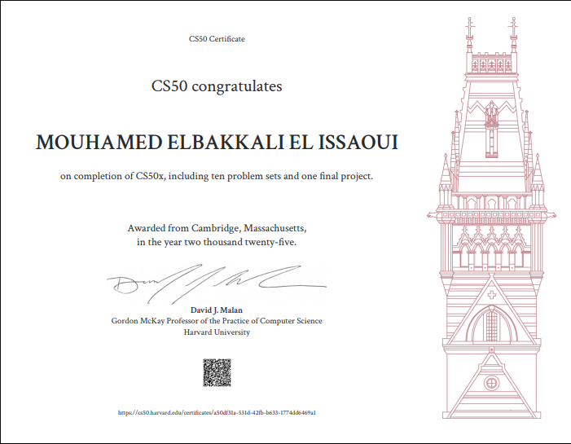

# CS50x 2025 - My Journey in Computer Science

This repository contains my solutions and projects for Harvard's CS50x Introduction to Computer Science course (2025 edition).

## About CS50

CS50x is Harvard University's introduction to the intellectual enterprises of computer science and the art of programming. This course teaches students how to think algorithmically and solve problems efficiently.

## Course Structure

| Week | Topic | Projects | Language |
|------|-------|----------|----------|
| 0 | Scratch | [Simple Starfish Game](https://scratch.mit.edu/projects/1077515650) | Scratch |
| 1 | C Programming | [Me (Hello)](week 0/me), [Mario (less)](Week 1/mario-less), [Cash](Week 1/cash) | C |
| 2 | Arrays | [Caesar](Week 2/caesar), [Readability](Week 2/readability), [Scrabble](Week 2/scrabble) | C |
| 3 | Algorithms | [Sort](Week 3/sort), [Plurality](Week 3/plurality), [Runoff](Week 3/runoff) | C |
| 4 | Memory | [Volume](week 4/volume), [Filter (Less)](week 4/filter-less), [Recover](week 4/recover) | C |
| 5 | Data Structures | [Inheritance](week 5/inheritance), [Speller](week 5/speller) | C |
| 6 | Python | [Hello](week 6/hello), [Cash](week 6/cash), [Readability](week 6/sentimental-readability), [DNA](week 6/dna) | Python |
| 7 | SQL | [Songs](week 7/songs), [Movies](week 7/movies), [Fiftyville](week 7/fiftyville) | SQL, Python |
| 8 | Web Development | [Homepage](week 8/homepage), [Trivia](week 8/trivia) | HTML, CSS, JavaScript |
| 9 | Flask | [Birthdays](week 9/birthdays), [Finance](week 9/finance) | Python, Flask |
| 10 | Final Project | [Final Project](week 10/project) | Various |

## How to Use This Repository

Each week's projects are organized in their respective directories:

- Clone this repository: `git clone <repository-url>`
- Navigate to a specific week: `cd Week X`
- Run or compile the programs as specified in the individual project README files

## Technologies Used

- C programming language
- Python
- SQL
- HTML, CSS, JavaScript
- Flask web framework

## Author

Haytham Hammioui

## License

This project is part of the CS50x coursework and follows the course's guidelines for academic work.

